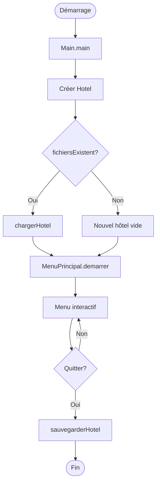
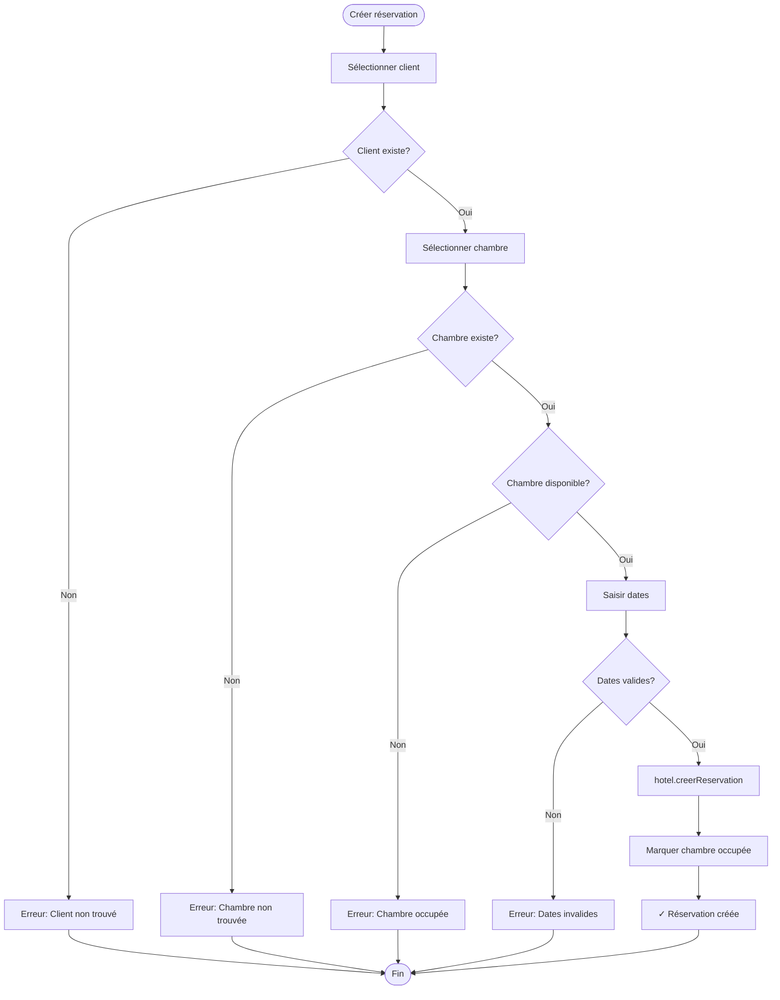
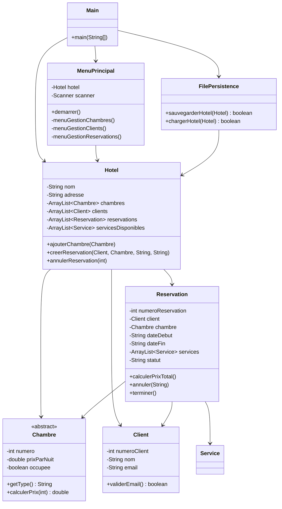

# Plan de compréhension du projet - Système de Gestion

d'Hôtel

## Vue d'ensemble

Ce projet est une application Java console pour gérer un hôtel. Il permet de gérer les chambres, clients, réservations, services et de générer des statistiques. Les données sont persistées dans des fichiers texte.

## Architecture du projet

### Structure en couches

Le projet suit une architecture en couches :

1. **Couche Model** (`com.gestionhotel.model`) : Entités métier

- `Chambre` (abstraite) et ses implémentations : `ChambreSimple`, `ChambreDouble`, `Suite`
- `Client` : Gestion des clients avec validation d'email
- `Reservation` : Gestion des réservations avec statuts et calculs de prix
- `Service` : Services additionnels (petit-déjeuner, spa, etc.)
- `GestionnaireClient` : Gestion centralisée des clients

2. **Couche Core** (`com.gestionhotel.core`) : Logique métier

- `Hotel` : Classe centrale orchestrant toutes les opérations
- `Statistiques` : Calculs et rapports statistiques

3. **Couche UI** (`com.gestionhotel.ui`) : Interface utilisateur

- `MenuPrincipal` : Menu console interactif avec sous-menus

4. **Couche Utils** (`com.gestionhotel.utils`) : Utilitaires

- `FilePersistence` : Sauvegarde/chargement des données
- `DateUtils` : Manipulation des dates (format français)
- `ValidationUtils` : Validation des données

5. **Couche Exceptions** (`com.gestionhotel.exceptions`) : Gestion des erreurs

- `HotelException`, `BusinessException`, `ValidationException`, `NotFoundException`

## Flux d'exécution principal

### Démarrage de l'application

1. **Main.java** ([src/main/java/com/gestionhotel/Main.java](src/main/java/com/gestionhotel/Main.java))

- Crée une instance d'`Hotel` avec nom et adresse
- Vérifie l'existence de fichiers de sauvegarde via `FilePersistence.fichiersExistent()`
- Charge les données existantes via `FilePersistence.chargerHotel()`
- Lance le `MenuPrincipal`
- À la fermeture, sauvegarde automatiquement via `FilePersistence.sauvegarderHotel()`

### Cycle de vie d'une réservation

1. **Création** : Client sélectionne une chambre disponible et des dates
2. **Validation** : Vérification de la disponibilité, validité des dates
3. **Statuts** : "En cours" → "Confirmée" → "Terminée" ou "Annulée"
4. **Services** : Ajout optionnel de services (petit-déjeuner, spa, etc.)
5. **Calcul du prix** : Chambre (prix × nuits) + Services
6. **Check-out** : Libération de la chambre et finalisation

## Composants clés

### Hotel.java - Le cœur du système

La classe `Hotel` ([src/main/java/com/gestionhotel/core/Hotel.java](src/main/java/com/gestionhotel/core/Hotel.java)) centralise toutes les opérations :

- **Gestion des chambres** : Ajout, recherche (par numéro, type, prix), affichage
- **Gestion des clients** : Via `GestionnaireClient`, recherche par numéro ou email
- **Gestion des réservations** : Création avec validation, annulation, finalisation
- **Gestion des services** : Ajout et affichage des services disponibles

### FilePersistence.java - Persistance des données

La classe `FilePersistence` ([src/main/java/com/gestionhotel/utils/FilePersistence.java](src/main/java/com/gestionhotel/utils/FilePersistence.java)) gère la sauvegarde dans le répertoire `data/` :

- `chambres.txt` : Type|Numéro|Prix|Capacité|Occupée|[Attributs spécifiques]
- `clients.txt` : Numéro|Nom|Prénom|Email|Téléphone
- `reservations.txt` : Numéro|Client|Chambre|DateDébut|DateFin|Statut|[Annulation|Raison]|SERVICES:ids
- `services.txt` : ID|Nom|Description|Prix|Disponible
- `hotel.txt` : Nom|Adresse

### MenuPrincipal.java - Interface utilisateur

Le menu ([src/main/java/com/gestionhotel/ui/MenuPrincipal.java](src/main/java/com/gestionhotel/ui/MenuPrincipal.java)) propose 5 sous-menus :

1. **Gestion des Chambres** : Ajout, recherche, affichage
2. **Gestion des Clients** : Ajout, modification, recherche
3. **Gestion des Réservations** : Création, annulation, ajout de services
4. **Gestion des Services** : Ajout, modification des services
5. **Statistiques** : CA, taux d'occupation, chambre la plus réservée, fidélité client

### Reservation.java - Gestion des réservations

La classe `Reservation` ([src/main/java/com/gestionhotel/model/Reservation.java](src/main/java/com/gestionhotel/model/Reservation.java)) gère :

- **Statuts** : "En cours", "Confirmée", "Annulée", "Terminée"
- **Calculs** : Nombre de nuits, prix chambre, prix services, prix total
- **Transitions** : Confirmation, annulation (avec raison), finalisation
- **Services** : Ajout de services additionnels à une réservation

### Statistiques.java - Analyses

La classe `Statistiques` ([src/main/java/com/gestionhotel/core/Statistiques.java](src/main/java/com/gestionhotel/core/Statistiques.java)) calcule :

- Chiffre d'affaires total et par statut
- Taux d'occupation
- Chambre la plus réservée
- Client le plus fidèle
- Service le plus utilisé
- Revenu moyen par réservation
- Nombre moyen de nuits

## Diagrammes de flux

### Flux de démarrage

### Flux de création de réservation

### Architecture des classes principales

## Points importants à comprendre

### 1. Gestion des statuts de réservation

Les réservations passent par différents statuts :

- **"En cours"** : Réservation créée mais non confirmée
- **"Confirmée"** : Réservation validée par le client
- **"Annulée"** : Réservation annulée (avec date et raison)
- **"Terminée"** : Séjour terminé (check-out effectué)

### 2. Système de persistance

Les données sont sauvegardées dans des fichiers texte avec format pipe (`|`) :

- Sauvegarde automatique à la fermeture
- Chargement automatique au démarrage
- Format simple et lisible

### 3. Gestion des erreurs

- Try-catch global dans `Main.java` et `MenuPrincipal.java`
- Validation des données avant création (dates, disponibilité)
- Messages d'erreur explicites pour l'utilisateur

### 4. Calculs automatiques

- Prix total = (Prix chambre × Nuits) + Somme des services
- Nombre de nuits calculé automatiquement à partir des dates
- Statistiques calculées en temps réel

### 5. Programme de fidélité

Le menu statistiques inclut un système de fidélité :

- Statuts : Bronze, Argent, Or, Platine
- Réductions progressives selon le nombre de réservations
- Offres spéciales selon le niveau

## Fichiers à examiner en priorité

1. **[Main.java](src/main/java/com/gestionhotel/Main.java)** : Point d'entrée
2. **[Hotel.java](src/main/java/com/gestionhotel/core/Hotel.java)** : Logique métier principale
3. **[MenuPrincipal.java](src/main/java/com/gestionhotel/ui/MenuPrincipal.java)** : Interface utilisateur
4. **[Reservation.java](src/main/java/com/gestionhotel/model/Reservation.java)** : Gestion des réservations
5. **[FilePersistence.java](src/main/java/com/gestionhotel/utils/FilePersistence.java)** : Persistance

## Commandes utiles